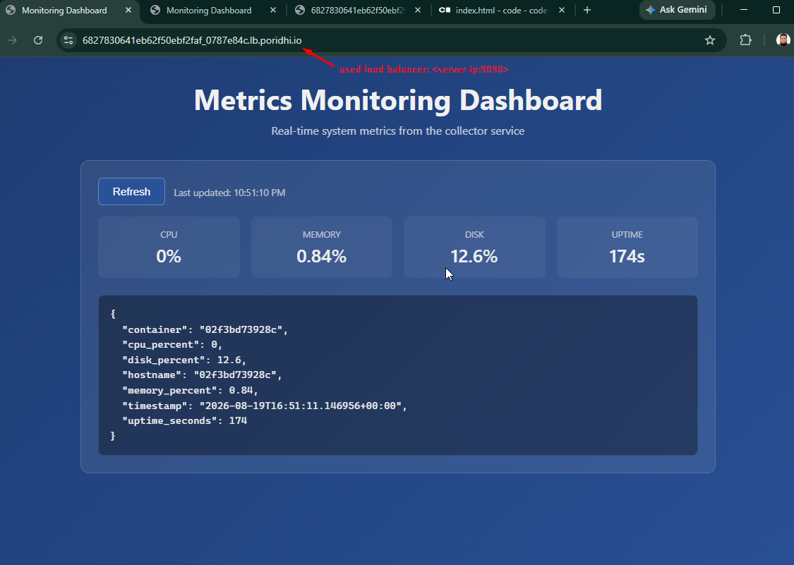
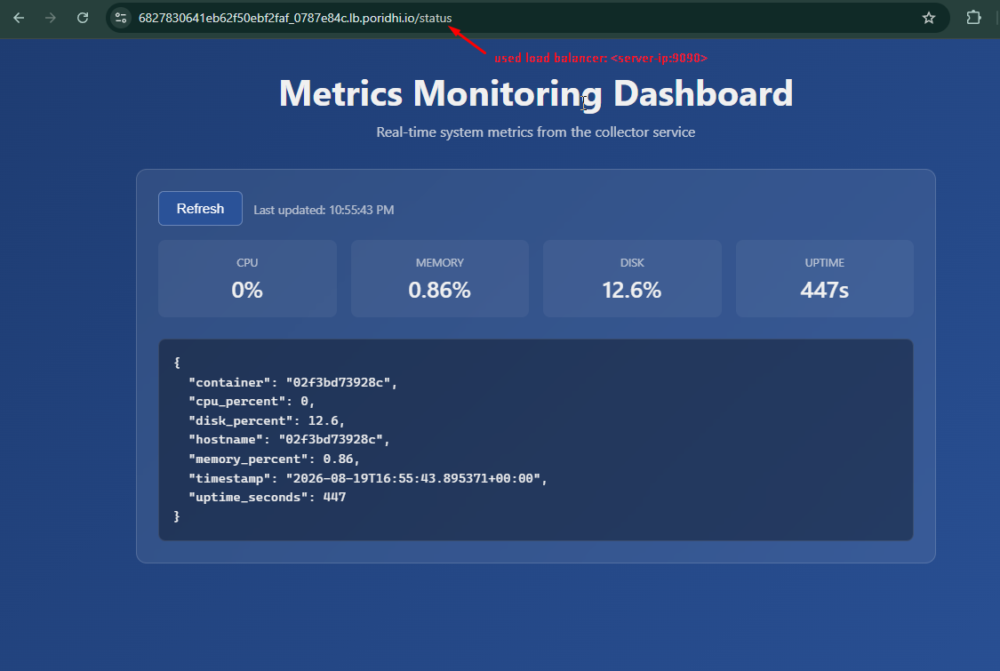
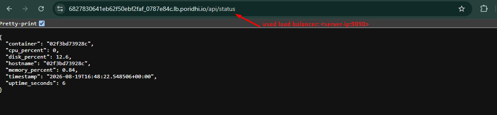
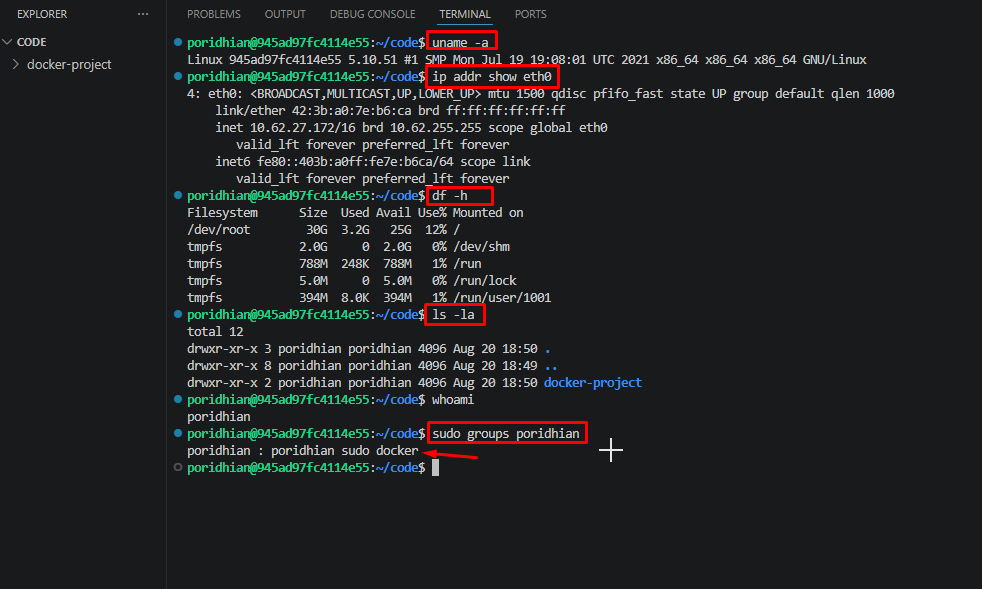
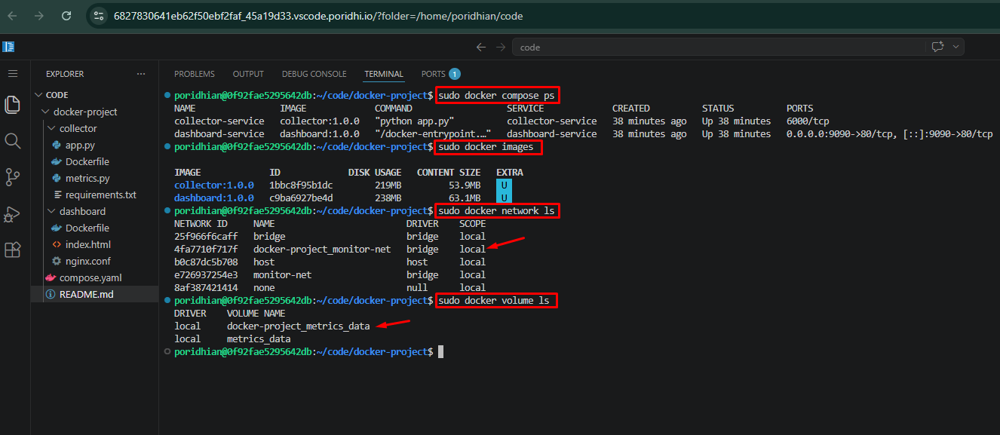

# Docker Metrics Monitoring Dashboard 
A complete professional guide for deploying a two-container metrics dashboard application (Python collector + Nginx dashboard) on an Ubuntu server using Docker.

---

## Table of Contents

| §  | Section | Description |
|----|---------|-------------|
| 0  | [Live Deployment Preview](#screenshot-of-the-working-dashboard--live-deployment-preview) | Screenshots of the deployed stack running behind the load balancer |
| 1  | **[TASK 1 — Linux Environment Setup](#task-1--linux-environment-setup)** | Install Docker Engine, CLI, containerd, Buildx, and Docker Compose |
| 1.1 | &nbsp;&nbsp;&nbsp;Phase 1 — Docker Engine Installation | APT repository, GPG key, package install |
| 1.2 | &nbsp;&nbsp;&nbsp;Phase 2 — Docker Compose Installation | Standalone `docker-compose` v1.29.2 binary |
| 1.3 | &nbsp;&nbsp;&nbsp;Phase 3 — Project Structure | Source layout (collector/, dashboard/) |
| 2  | **[TASK 2 — Docker Basics, Image Management, Networking & Storage](#task-2--docker-basics-image-management-networking--storage)** | Build images via `docker commit`, create network + volume, run containers |
| 2.1 | &nbsp;&nbsp;&nbsp;Phase 4 — Build the Collector Service | Pull python:3.12-slim, install deps, commit |
| 2.2 | &nbsp;&nbsp;&nbsp;Phase 5 — Create Network & Volume | `monitor-net` bridge + `metrics_data` volume |
| 2.3 | &nbsp;&nbsp;&nbsp;Phase 6 — Run the Collector Container | `docker run` with volume + network |
| 2.4 | &nbsp;&nbsp;&nbsp;Phase 7 — Build the Dashboard Service | Nginx image + custom `index.html` and `nginx.conf` |
| 2.5 | &nbsp;&nbsp;&nbsp;Phase 8 — Run the Dashboard Container | Port publishing `9090:80` |
| 2.6 | &nbsp;&nbsp;&nbsp;Phase 9 — Verification & Testing | Curl tests, network/volume inspection |
| 2.7 | &nbsp;&nbsp;&nbsp;Quick Reference Commands | Lifecycle, images, networks, volumes |
| 2.8 | &nbsp;&nbsp;&nbsp;Troubleshooting | Symptom / Cause / Fix table |
| 2.9 | &nbsp;&nbsp;&nbsp;Appendix A — Cleanup | Tear-down commands |
| 2.10| &nbsp;&nbsp;&nbsp;Appendix B — Final Stack Summary | Runtime topology diagram |
| 3  | **[TASK 3 — Dockerize the Application](#task-3-dockerize-the-application)** | Per-service Dockerfiles, independent build & lifecycle |
| 3.1 | &nbsp;&nbsp;&nbsp;Build the Collector Image | `docker build` from `collector/Dockerfile` |
| 3.2 | &nbsp;&nbsp;&nbsp;Build the Dashboard Image | `docker build` from `dashboard/Dockerfile` |
| 3.3 | &nbsp;&nbsp;&nbsp;Shared Network & Volume | `monitor-net` + `metrics_data` |
| 3.4 | &nbsp;&nbsp;&nbsp;Run the Collector Container | `docker run` (no host port) |
| 3.5 | &nbsp;&nbsp;&nbsp;Run the Dashboard Container | `docker run -p 9090:80` |
| 3.6 | &nbsp;&nbsp;&nbsp;Verify the Stack | `docker ps`, network inspection, curl |
| 3.7 | &nbsp;&nbsp;&nbsp;Independence at Build / Update Time | Rebuild one service without touching the other |
| 3.8 | &nbsp;&nbsp;&nbsp;Independent Lifecycle Commands | Start / stop / logs / rm per container |
| 3.9 | &nbsp;&nbsp;&nbsp;Tear-Down | Remove containers, images, network, volume |
| 4  | **[TASK 4 — Docker Compose](#task-4-docker-compose)** | Declarative multi-container orchestration with one command |
| 4.1 | &nbsp;&nbsp;&nbsp;The `compose.yaml` File | Full Compose definition |
| 4.2 | &nbsp;&nbsp;&nbsp;Compose Field-by-Field Explanation | services / networks / volumes blocks |
| 4.3 | &nbsp;&nbsp;&nbsp;Dockerfiles Reused As-Is | Collector + Dashboard Dockerfiles |
| 4.4 | &nbsp;&nbsp;&nbsp;One-Command Bring-Up | `docker compose up -d --build` |
| 4.5 | &nbsp;&nbsp;&nbsp;Verification & Testing | Curl, network inspect, volume ls |
| 4.6 | &nbsp;&nbsp;&nbsp;Day-2 Operations | Logs, exec, rebuild, stop, down |
| 4.7 | &nbsp;&nbsp;&nbsp;`docker compose` vs `docker run` | Side-by-side command comparison |
| 5  | **[Task 5 — Monitoring & Troubleshooting](#task-5--monitoring--troubleshooting)** | Live dashboard verification + project structure |
| 5.1 | &nbsp;&nbsp;&nbsp;Troubleshooting | Compose failure scenarios |
| 5.2 | &nbsp;&nbsp;&nbsp;Project Structure | ASCII tree + runtime architecture + request flow |
| 5.3 | &nbsp;&nbsp;&nbsp;Dashboard Screenshots | Home / status / API JSON / compose ps |
| 5.4 | &nbsp;&nbsp;&nbsp;Short Questions Answer | Review Q&A |

---

## Screenshot of the working dashboard. — Live Deployment Preview

The following screenshots capture the deployed stack running behind a load balancer at `http://<server-ip>:9090/`.

### 1. Dashboard Home — Metrics Monitoring Dashboard



The main dashboard UI served by the `dashboard-service` (Nginx on port `9090 → 80`). It displays real-time system metrics (CPU, Memory, Disk, Uptime) collected by the `collector-service`, plus the raw JSON response from the collector API.

### 2. Collector Status Page



The collector's `/status` endpoint, reached through the dashboard's reverse proxy. The page shows the same metric tiles as the home page (CPU, Memory, Disk, Uptime) along with the JSON payload that powers them.

### 3. Collector API Status — Raw JSON Response



The raw JSON returned by the collector's `/api/status` endpoint via the dashboard reverse-proxy at `/api/*`. Confirms the dashboard is correctly wired to the collector service over the `monitor-net` bridge network.


```bash


```

# TASK 1 : Linux environment setup

## Phase 1 — Docker Engine Installation

If not installed then Install Docker CE, CLI, containerd, and Buildx from Docker's official APT repository.

```bash
# 1. Update the package index
sudo apt update

# 2. Install required packages for the Docker repository
sudo apt install -y ca-certificates curl gnupg

# 3. Create the keyring directory
sudo install -m 0755 -d /etc/apt/keyrings

# 4. Download Docker's official GPG key
curl -fsSL https://download.docker.com/linux/ubuntu/gpg \
  | sudo gpg --dearmor -o /etc/apt/keyrings/docker.gpg

# 5. Make the GPG key readable
sudo chmod a+r /etc/apt/keyrings/docker.gpg

# 6. Add the Docker APT repository
echo \
  "deb [arch=$(dpkg --print-architecture) signed-by=/etc/apt/keyrings/docker.gpg] https://download.docker.com/linux/ubuntu \
  $(. /etc/os-release && echo "$VERSION_CODENAME") stable" \
  | sudo tee /etc/apt/sources.list.d/docker.list > /dev/null

# 7. Refresh the package index
sudo apt update

# 8. Verify candidate version
apt-cache policy docker-ce

# 9. Install Docker Engine, CLI, containerd, Buildx, and Compose plugin
sudo apt install -y \
  docker-ce \
  docker-ce-cli \
  containerd.io \
  docker-buildx-plugin \
  docker-compose-plugin

# 10. Verify Docker is running
sudo systemctl status docker
```

---

## Phase 2 — Docker Compose Installation

Install the standalone `docker-compose` binary (v1.29.2). The `docker compose` plugin was installed in Phase 1; this provides the older v1 syntax as well.

```bash
# 1. Download the standalone docker-compose binary
sudo curl -L \
  "https://github.com/docker/compose/releases/download/1.29.2/docker-compose-$(uname -s)-$(uname -m)" \
  -o /usr/local/bin/docker-compose

# 2. Make it executable
sudo chmod +x /usr/local/bin/docker-compose

# 3. Verify the installation
docker-compose --version
```

---

## Phase 3 — Project Structure

Move into the project directory and prepare the source files.

```bash
cd ~/docker-project/

# Project layout (already present):
#   collector/        ← Python app source (app.py, requirements.txt, ...)
#   dashboard/        ← index.html + nginx.conf
#   compose.yaml      ← Compose definition (optional)
```

**Expected `dashboard/` contents:**

- `index.html` — dashboard UI (replaces nginx default page)
- `nginx.conf` — server block that reverse-proxies `/api/*` to the `collector` service

---

## Phase 4 — Check Host Info and others

```bash
sudo uname -a
sudo ip addr show eth0
sudo df -h
sudo ls -la
sudo groups poridhian
```



```bash


```


  # TASK 2 : Docker Basics, Image Management, Networking & Storage

## Phase 4 — Build the Collector Service

The collector is a Python 3.12 application that exposes a metrics API on port 6000.

### 4.1 Pull the base image

```bash
sudo docker pull python:3.12-slim
```

### 4.2 Start a temporary build container

```bash
sudo docker run -dit \
  --name collector-build \
  python:3.12-slim \
  bash
```

### 4.3 Copy application source into the container

```bash
sudo docker cp collector/. collector-build:/app/
```

### 4.4 Install dependencies inside the container

You can install dependencies either **interactively** (recommended for debugging) or **non-interactively** (recommended for automated/CI builds).

#### Option A — Interactive shell (manual debugging)

```bash
sudo docker exec -it collector-build bash
```

Inside the container shell:

```bash
cd /app

apt-get update

pip install --no-cache-dir -r requirements.txt

apt-get install -y --no-install-recommends curl ca-certificates

exit

```

#### Option B — Non-interactive one-shot command (CI / scripted builds)

Run `apt-get update` and `pip install` as a single `bash -lc` chain so the container installs everything in one pass and then idles. This avoids the need for an interactive shell and is reproducible.

```bash
sudo docker exec collector-build \
  bash -lc "apt-get update && apt-get install -y --no-install-recommends curl ca-certificates && pip install --no-cache-dir -r /app/requirements.txt && tail -f /dev/null"
```

**Command breakdown:**

| Segment | Purpose |
|---------|---------|
| `apt-get update` | Refresh the package index inside the slim image |
| `apt-get install -y --no-install-recommends curl ca-certificates` | Install network/SSL helpers needed by `pip` |
| `pip install --no-cache-dir -r requirements.txt` | Install Python dependencies (no cache to keep the layer small) |
| `tail -f /dev/null` | Keep the container alive so `docker exec` can return cleanly |

> **Note:** This command does not modify the committed image — you still need the `docker commit` step that follows to bake the installed packages into a reusable image.

### 4.5 Commit the build container into a reusable image

```bash
sudo docker commit \
  -c 'WORKDIR /app' \
  -c 'EXPOSE 6000' \
  -c 'CMD ["python", "app.py"]' \
  collector-build \
  collector:1.0.0
```

> This tags the committed image directly as **`collector:1.0.0`** (per the SemVer policy in §2.5). To also keep a `:dev` and `:latest` tag, see §2.5 "Build & tag workflow".

### 4.6 Verify the image metadata

```bash
sudo docker image inspect collector:1.0.0 \
  --format 'WORKDIR={{.Config.WorkingDir}}  EXPOSED={{json .Config.ExposedPorts}}  CMD={{json .Config.Cmd}}'
```

**Expected output (example):**

```
WORKDIR=/app  EXPOSED=map["6000/tcp":{}]  CMD=["python","app.py"]
```

### 4.7 Remove the build container

```bash
sudo docker rm -f collector-build
```

---

## Phase 5 — Create Network & Volume

### 5.1 Create a custom bridge network

```bash
sudo docker network create monitor-net
sudo docker network ls
```

### 5.2 Create a named volume for metrics persistence

```bash
sudo docker volume create metrics_data
sudo docker volume ls
```

---

## Phase 6 — Run the Collector Container

Launch the collector as a long-running service that uses the volume, network, and restarts automatically.

```bash
sudo docker run -d \
  --name collector-service \
  --restart unless-stopped \
  --network monitor-net \
  -v metrics_data:/data \
  collector:1.0.0
```

**Flag breakdown:**

| Flag | Purpose |
|------|---------|
| `-d` | Detached (background) mode |
| `--name collector-service` | Stable container name |
| `--restart unless-stopped` | Auto-restart on reboot / crash |
| `--network monitor-net` | Attach to the shared network |
| `-v metrics_data:/data` | Mount the named volume to `/data` |

### Verify the collector is up

```bash
sudo docker ps
sudo docker logs collector-service
```

---

## Phase 7 — Build the Dashboard Service

The dashboard is served by Nginx, with a custom `index.html` and a custom config that proxies `/api/*` to the `collector`.

### 7.1 Pull the Nginx image

```bash
sudo docker pull nginx:latest
sudo docker image ls

# Inspect the default exposed port
sudo docker image inspect nginx:latest \
  --format '{{.Config.ExposedPorts}}'
```

### 7.2 Start a temporary build container

```bash
sudo docker run -d --name dashboard-build nginx:latest
```

### 7.3 Replace the default Nginx page

```bash
# Remove the default index page
sudo docker exec dashboard-build rm /usr/share/nginx/html/index.html

# Copy the project's dashboard UI into place
sudo docker cp ./dashboard/index.html dashboard-build:/usr/share/nginx/html/index.html
```

### 7.4 Replace the Nginx server config

```bash
# Remove the default server block
sudo docker exec dashboard-build rm -f /etc/nginx/conf.d/default.conf

# Copy the project's nginx.conf as the active server config
sudo docker cp ./dashboard/nginx.conf dashboard-build:/etc/nginx/conf.d/app.conf

```

### 7.5 Commit the build container into a reusable image

```bash
sudo docker commit \
  -c 'EXPOSE 80' \
  -c 'CMD ["nginx", "-g", "daemon off;"]' \
  dashboard-build \
  dashboard:1.0.0
```

### 7.8 Remove the dashboard-build container
```bash
sudo docker rm -f dashboard-build
```
---

## Phase 8 — Run the Dashboard Container

```bash
sudo docker run -d \
  --name dashboard-service \
  --restart unless-stopped \
  --network monitor-net \
  -p 9090:80 \
  dashboard:1.0.0
```
```bash
# Validate the configuration
sudo docker exec dashboard-service nginx -t
```

**Flag breakdown:**

| Flag | Purpose |
|------|---------|
| `-d` | Detached mode |
| `--name dashboard-service` | Stable container name |
| `--network monitor-net` | Lets nginx reach `collector-service` by container name |
| `-p 9090:80` | Publish host port 9090 → container port 80 |

### Verify both containers

```bash
sudo docker ps
sudo docker network inspect monitor-net \
  --format '{{range .Containers}}{{.Name}} {{end}}'
```

**Expected output:**

```
collector-service dashboard-service
```

---

## Phase 9 — Verification & Testing

### 9.1 Dashboard reachable from the host

```bash
sudo curl http://localhost:9090/

sudo curl http://<server-ip>:9090/
```

### 9.2 Collector reachable from the host (via dashboard port-forward path)

```bash
sudo curl http://localhost:9090/api/status

sudo curl http://<server-ip>:9090/api/status
```

### 9.3 Collector reachable directly from inside its own network

```bash
sudo docker exec collector-service curl http://localhost:6000/status

sudo docker exec collector-service curl http://collector-service:6000/status
```

### 9.4 Dashboard container can reach the collector by service name

```bash
sudo docker exec dashboard-service curl http://collector-service:6000/status
```

### 9.5 Inspect the volume

```bash
sudo docker volume inspect metrics_data
```

---

## 10. Quick Reference Commands

### Container lifecycle

```bash
sudo docker ps                 # Running containers
sudo docker ps -a              # All containers
sudo docker start <name>       # Start a stopped container
sudo docker stop  <name>       # Stop a running container
sudo docker restart <name>     # Restart
sudo docker rm -f <name>       # Remove
sudo docker logs <name>        # View logs
sudo docker exec -it <name> bash   # Shell into container
```

### Images

```bash
sudo docker images             # List images
sudo docker pull <image>       # Pull image
sudo docker rmi <image>        # Remove image
sudo docker rmi -f <image>     # Force remove
sudo docker image inspect <image> --format '{{.Config.Cmd}}'
```

### Networks

```bash
sudo docker network ls
sudo docker network create <name>
sudo docker network inspect <name>
sudo docker network rm <name>
```

### Volumes

```bash
sudo docker volume ls
sudo docker volume create <name>
sudo docker volume inspect <name>
sudo docker volume rm <name>
```

---

## 11. Troubleshooting

| Symptom | Likely Cause | Fix |
|---------|--------------|-----|
| `sudo: 'history': command not found` | Running `history` through `sudo` | Run `history` directly (no sudo) |
| `sudo docker <cmd> → permission denied` | User not in `docker` group | `sudo usermod -aG docker $USER` then re-login |
| Container exits immediately | Bad CMD or missing dependency | `sudo docker logs <name>` to inspect |
| `docker: command not found` | PATH issue after install | `sudo systemctl restart docker` and reopen shell |
| `curl http://collector-service:6000/...` fails from dashboard-service | Containers not on same network | Re-run with `--network monitor-net` on both |
| Volume data disappears on container recreate | Used bind-mount path instead of named volume | Always use `-v <volume_name>:<container_path>` |
| `nginx -t` reports syntax error | Bad `nginx.conf` copy | Re-check `dashboard/nginx.conf`, then `sudo docker restart dashboard-build` |

---

## Appendix A — Cleanup (Tear Down)

```bash
# Stop and remove containers
sudo docker rm -f collector-service dashboard-service collector-build dashboard-build

# Remove images
sudo docker rmi -f collector:1.0.0 dashboard:1.0.0

# Remove network and volume (CAUTION: deletes persisted metrics)
sudo docker network rm monitor-net
sudo docker volume rm metrics_data
```

---

## Appendix B — Final Stack Summary

```
Host (Ubuntu)
  ├── monitor-net  (custom bridge)
  │     ├── collector-service  (collector:1.0.0 ← python:3.12-slim + /app)  → listens on :6000
  │     └── dashboard-service  (dashboard:1.0.0 ← nginx:latest + custom UI/conf)  → listens on :80
  ├── metrics_data (named volume)  → mounted at /data in collector
  └── Port mapping: 9090 → dashboard:80
```

---

**Document version:** 1.0
**Last updated:** 2026-08-18

```bash


```

# TASK 3: Dockerize the Application

In this task, each service is built **independently** from its own `Dockerfile` (no `docker commit` workaround, no shared `compose.yaml`), but at **runtime** the two containers are wired together exactly the way TASK 2 wires them — they share the `monitor-net` bridge network, the collector mounts the `metrics_data` volume, and the dashboard publishes the same `9090:80` host port. Each container, however, still has its own image and its own independent lifecycle.


---

## 3.1 — Build the Collector Image (from its own Dockerfile)

### Step 1 — Move into the collector folder

```bash
cd ~/docker-project/collector
```

### Step 2 — Build the image from the Dockerfile

```bash
sudo docker build -t collector:1.0.0 .
```

**What happens during the build (one layer per Dockerfile instruction):**

| Layer | Dockerfile instruction | Effect |
|-------|------------------------|--------|
| 1 | `FROM python:3.12-slim` | Pulls the slim Python 3.12 base image |
| 2 | `WORKDIR /app` | Sets `/app` as the working directory inside the image |
| 3 | `RUN apt-get update && apt-get install -y --no-install-recommends curl ca-certificates && rm -rf /var/lib/apt/lists/*` | Installs `curl` and `ca-certificates` for HTTPS calls, then cleans the apt cache |
| 4 | `COPY requirements.txt .` | Copies the dependency list into `/app` |
| 5 | `RUN pip install --no-cache-dir -r requirements.txt` | Installs Python dependencies (no cache → smaller layer) |
| 6 | `COPY app.py metrics.py ./` | Copies the application source into the image |
| 7 | `EXPOSE 6000` | Documents that the container listens on `6000/tcp` |
| 8 | `CMD ["python", "app.py"]` | Default start command — launches the Flask app |

### Step 3 — Verify the image

```bash
sudo docker images | grep collector
```

**Expected output:**

```
collector   1.0.0   <image_id>   About a minute ago   <size>
```

---

## 3.2 — Build the Dashboard Image (from its own Dockerfile)

### Step 1 — Move into the dashboard folder

```bash
cd ~/docker-project/dashboard
```

### Step 2 — Build the image from the Dockerfile

```bash
sudo docker build -t dashboard:1.0.0 .
```

**What happens during the build (one layer per Dockerfile instruction):**

| Layer | Dockerfile instruction | Effect |
|-------|------------------------|--------|
| 1 | `FROM nginx:latest` | Pulls the latest official Nginx image |
| 2 | `RUN rm -f /etc/nginx/conf.d/default.conf` | Deletes Nginx's bundled default server block |
| 3 | `COPY nginx.conf /etc/nginx/conf.d/app.conf` | Installs the project's `nginx.conf` as the active server config |
| 4 | `COPY index.html /usr/share/nginx/html/index.html` | Replaces the default Nginx welcome page with the project dashboard UI |
| 5 | `EXPOSE 80` | Documents that the container listens on `80/tcp` |
| 6 | `CMD ["nginx", "-g", "daemon off;"]` | Default start command — runs Nginx in the foreground |

### Step 3 — Verify the image

```bash
sudo docker images | grep dashboard
```

**Expected output:**

```
dashboard   1.0.0   <image_id>   About a minute ago   <size>
```

> At this point you have **two independent images**: `collector:1.0.0` and `dashboard:1.0.0`. Either one can be started on its own. The next steps wire them into the same `monitor-net` network and the same `metrics_data` volume, exactly as TASK 2 does.

---

## 3.3 — Create the Shared Network & Volume

These two resources are the **runtime wiring** that connects the otherwise-independent containers. They are created once, then both containers attach to them.

### 3.3.1 Create the custom bridge network

```bash
sudo docker network create monitor-net
sudo docker network ls
```

### 3.3.2 Create the named volume for metrics persistence

```bash
sudo docker volume create metrics_data
sudo docker volume ls
```

---

## 3.4 — Run the Collector Container

The collector uses the shared network and the shared volume, but **no host port** — it is reached only through `monitor-net` (e.g. from the dashboard container), exactly as in TASK 2 / Phase 6.

```bash
sudo docker run -d \
  --name collector-service \
  --restart unless-stopped \
  --network monitor-net \
  -v metrics_data:/data \
  collector:1.0.0
```

**Flag breakdown:**

| Flag | Purpose |
|------|---------|
| `-d` | Detached (background) mode |
| `--name collector-service` | Stable container name (also the DNS hostname the dashboard will use) |
| `--restart unless-stopped` | Auto-restart on reboot / crash |
| `--network monitor-net` | Attach to the shared bridge network from §3.3.1 |
| `-v metrics_data:/data` | Mount the named volume from §3.3.2 at `/data` |
| *(no `-p`)* | The collector is NOT published to the host — it is only reachable via `monitor-net` |

### Verify the collector is up

```bash
sudo docker ps
sudo docker logs collector-service
```

---

## 3.5 — Run the Dashboard Container

The dashboard joins the **same** `monitor-net` network so it can reach the collector by name, and publishes the same host port mapping (`9090:80`) used in TASK 2 / Phase 8.

```bash
sudo docker run -d \
  --name dashboard-service \
  --restart unless-stopped \
  --network monitor-net \
  -p 9090:80 \
  dashboard:1.0.0
```

```bash
# Validate the Nginx configuration inside the running container
sudo docker exec dashboard-service nginx -t
```

**Flag breakdown:**

| Flag | Purpose |
|------|---------|
| `-d` | Detached mode |
| `--name dashboard-service` | Stable container name |
| `--restart unless-stopped` | Auto-restart on reboot / crash |
| `--network monitor-net` | Lets Nginx reach `collector-service` by container name through the shared bridge |
| `-p 9090:80` | Publish host port `9090` → container port `80` |

---

## 3.6 — Verify the Stack

### 3.6.1 Both containers are running

```bash
sudo docker ps --format 'table {{.Names}}\t{{.Image}}\t{{.Ports}}\t{{.Status}}'
```

**Expected output:**

```
NAMES               IMAGE             PORTS                  STATUS
collector-service   collector:1.0.0                          Up X minutes
dashboard-service   dashboard:1.0.0   0.0.0.0:9090->80      Up X minutes
```

### 3.6.2 Both containers are on the same network

```bash
sudo docker network inspect monitor-net \
  --format '{{range .Containers}}{{.Name}} {{end}}'
```

**Expected output:**

```
collector-service dashboard-service
```

### 3.6.3 Dashboard reachable from the host

```bash
sudo curl http://localhost:9090/
```

### 3.6.4 Dashboard reverse-proxies `/api/*` to the collector (same path as TASK 2 / §9.2)

```bash
sudo curl http://localhost:9090/api/status
```

### 3.6.5 Collector reachable from inside its own network (by name)

```bash
sudo docker exec dashboard-service curl http://collector-service:6000/status
```

### 3.6.6 Volume is mounted

```bash
sudo docker volume inspect metrics_data
```

---

## 3.7 — Independence at Build / Update Time

Even though the two containers share one network and one volume at runtime, they are still **independent at build and update time**. Rebuilding one image does not touch the other container.

### Rebuild only the collector (after changing `collector/app.py`, `metrics.py`, or `requirements.txt`)

```bash
cd ~/docker-project/collector
sudo docker build -t collector:1.0.0 .
sudo docker rm -f collector-service
sudo docker run -d \
  --name collector-service \
  --restart unless-stopped \
  --network monitor-net \
  -v metrics_data:/data \
  collector:1.0.0
```

`dashboard-service` keeps running throughout — only `collector-service` is replaced.

### Rebuild only the dashboard (after changing `dashboard/index.html` or `nginx.conf`)

```bash
cd ~/docker-project/dashboard
sudo docker build -t dashboard:1.0.0 .
sudo docker rm -f dashboard-service
sudo docker run -d \
  --name dashboard-service \
  --restart unless-stopped \
  --network monitor-net \
  -p 9090:80 \
  dashboard:1.0.0
```

`collector-service` keeps running throughout — only `dashboard-service` is replaced.

> **This is the operational benefit of the per-service Dockerfile model over the single-file `compose.yaml` model:** you can iterate on one service without disturbing the other.

---

## 3.8 — Independent Lifecycle Commands

Each container can be started, stopped, removed, and logged independently. The only things they share are the network and the volume.

```bash
# Start / stop independently
sudo docker start  collector-service
sudo docker stop   collector-service

sudo docker start  dashboard-service
sudo docker stop   dashboard-service

# Inspect logs independently
sudo docker logs -f collector-service
sudo docker logs -f dashboard-service

# Remove independently
sudo docker rm -f collector-service
sudo docker rm -f dashboard-service

# Remove the images independently
sudo docker rmi collector:1.0.0
sudo docker rmi dashboard:1.0.0
```

---

## 3.9 — Tear-Down

```bash
# Stop and remove both containers
sudo docker rm -f collector-service dashboard-service

# Remove both images
sudo docker rmi -f collector:1.0.0 dashboard:1.0.0

# Remove the shared network and volume (CAUTION: deletes persisted metrics)
sudo docker network rm monitor-net
sudo docker volume rm metrics_data
```

---

# TASK 4: Docker Compose

In this task, the entire multi-container application is defined declaratively in a single `compose.yaml` file. Docker Compose reads that file and **builds both images from their own Dockerfiles**, creates the `monitor-net` network, creates the `metrics_data` volume, and starts both containers — all with **one command**. There is no manual `docker build` / `docker run` / `docker network create` / `docker volume create` sequence: Compose owns the full lifecycle.

The two `Dockerfile`s from TASK 3 are reused unchanged. `compose.yaml` simply glues them together with the same wiring that TASK 2 and TASK 3 produced by hand:

- shared custom bridge → `monitor-net`
- shared named volume → `metrics_data` (mounted at `/data` inside the collector)
- shared service-discovery DNS name → `collector-service` is what the dashboard reverse-proxies to
- shared host port publishing → `9090:80` on the dashboard only (the collector is `expose`-d, not published)

---

## 4.1 — The `compose.yaml` File

The full contents of `~/docker-project/compose.yaml`:

```yaml
# Compose orchestration for the devops monitoring application.
#
# Two services share a custom bridge network (monitor-net) and the collector
# persists its snapshot history to a named volume (metrics_data).
#
# Communication:
#   Browser -> host:9090 -> dashboard-service:80 -> proxy -> collector-service:6000
#
#   The dashboard-service reverse-proxies /api/* to "http://collector-service:6000/*"
#   using the service name "collector-service" as the Docker-internal DNS host.

services:
  dashboard-service:
    build: ./dashboard
    image: dashboard:1.0.0
    container_name: dashboard-service
    ports:
      - "9090:80"
    networks:
      - monitor-net
    depends_on:
      - collector-service
    restart: unless-stopped

  collector-service:
    build: ./collector
    image: collector:1.0.0
    container_name: collector-service
    expose:
      - "6000"
    volumes:
      - metrics_data:/data
    networks:
      - monitor-net
    restart: unless-stopped

networks:
  monitor-net:
    driver: bridge

volumes:
  metrics_data:
```

---

## 4.2 — Compose Field-by-Field Explanation

### 4.2.1 `services:` block

Each entry under `services:` is one container that Compose will build and run.

#### `dashboard-service`

| Field | Value | Effect |
|-------|-------|--------|
| `build: ./dashboard` | Path to the build context | Compose runs `docker build` against the folder `dashboard/`, which contains the dashboard's `Dockerfile` (`FROM nginx:latest`, copies `nginx.conf` and `index.html`, etc.) |
| `image: dashboard:1.0.0` | Image name + tag | The image produced by the build is **tagged** as `dashboard:1.0.0`. If the image already exists with this tag, Compose reuses it instead of rebuilding |
| `container_name: dashboard-service` | Stable name | The running container is named `dashboard-service` (must be unique across the Docker host) |
| `ports: ["9090:80"]` | Host port mapping | The host's port `9090` is forwarded to the container's port `80` (the port Nginx listens on) |
| `networks: [monitor-net]` | Network attachment | Attaches this container to the custom bridge `monitor-net` so it can resolve `collector-service` by DNS |
| `depends_on: [collector-service]` | Start-order hint | Compose starts `collector-service` **before** `dashboard-service`. This is a *start-order* guarantee only — it does **not** wait for the collector to be ready to accept traffic |
| `restart: unless-stopped` | Restart policy | Auto-restart on crash or host reboot (unless the container was explicitly stopped) |

#### `collector-service`

| Field | Value | Effect |
|-------|-------|--------|
| `build: ./collector` | Path to the build context | Compose runs `docker build` against `collector/` (the `FROM python:3.12-slim` Dockerfile from TASK 3) |
| `image: collector:1.0.0` | Image name + tag | Tags the built image as `collector:1.0.0` |
| `container_name: collector-service` | Stable name | This name is also the **DNS hostname** the dashboard resolves via Docker's embedded DNS on `monitor-net` |
| `expose: ["6000"]` | Inter-container port | Documents port `6000/tcp` and makes it reachable to other containers on `monitor-net`. **No `-p` is used** — the collector is **not** reachable from the host directly |
| `volumes: [metrics_data:/data]` | Named volume mount | Mounts the managed `metrics_data` volume at `/data` inside the container so snapshot history survives container restarts |
| `networks: [monitor-net]` | Network attachment | Joins the same bridge as the dashboard, enabling name-based DNS |
| `restart: unless-stopped` | Restart policy | Auto-restart on crash / reboot |

### 4.2.2 `networks:` block

```yaml
networks:
  monitor-net:
    driver: bridge
```

- Declares a **user-defined bridge network** named `monitor-net`.
- Both services reference it under `networks:`, so Compose attaches both containers to it.
- User-defined bridges (unlike the default bridge) provide **automatic DNS** — `dashboard-service` can resolve the hostname `collector-service` and reach it on port `6000`.

This is what the dashboard's `nginx.conf` reverse-proxy depends on:

```
proxy_pass http://collector-service:6000/;
```

### 4.2.3 `volumes:` block

```yaml
volumes:
  metrics_data:
```

- Declares a **named volume** `metrics_data` that Compose manages.
- The `collector-service` mounts it at `/data` so persistence survives `docker compose down`.

If the volume did not exist before `docker compose up` runs, Compose creates it on first use and reuses it on subsequent runs.

---

## 4.3 — Dockerfiles Reused As-Is

Compose uses the existing TASK 3 Dockerfiles — nothing in them changes for TASK 4.

### Collector — `collector/Dockerfile`

```dockerfile
# Metrics Collector image: Python + Flask on port 6000.
FROM python:3.12-slim

WORKDIR /app

RUN apt-get update \
    && apt-get install -y --no-install-recommends curl ca-certificates \
    && rm -rf /var/lib/apt/lists/*

COPY requirements.txt .
RUN pip install --no-cache-dir -r requirements.txt

COPY app.py metrics.py ./

EXPOSE 6000
CMD ["python", "app.py"]
```

### Dashboard — `dashboard/Dockerfile`

```dockerfile
# Dashboard image: serves the metrics dashboard via NGINX and reverse-proxies
# /api/* requests to the "collector-service" service over the Docker network.
FROM nginx:latest

RUN rm -f /etc/nginx/conf.d/default.conf

COPY nginx.conf /etc/nginx/conf.d/app.conf
COPY index.html /usr/share/nginx/html/index.html

EXPOSE 80
CMD ["nginx", "-g", "daemon off;"]
```

> Each service has its **own** Dockerfile and its **own** build context (`./collector` and `./dashboard` respectively). Compose invokes them independently; the fact that both happen because of one `docker compose up` does not merge them into a single image.

---

## 4.4 — One-Command Bring-Up

### Step 1 — Move into the project root

```bash
cd ~/docker-project
```

### Step 2 — Validate the Compose file

```bash
sudo docker compose config
```

What this does:

- Parses `compose.yaml`.
- Resolves `build:` paths and interpolates any variables.
- Prints the fully-resolved Compose model.

**Why run it first:** Catches YAML/structural errors **before** any image is built or container is started.

### Step 3 — Build the images and start the stack

```bash
sudo docker compose up -d --build
```

What each part of the command does:

| Part | Effect |
|------|--------|
| `docker compose` | Uses the **Compose V2 plugin** (already installed in Phase 1) |
| `up` | Build (if needed) and start every service declared in `compose.yaml` |
| `-d` | Detached mode — return to the shell immediately, leave containers running in the background |
| `--build` | Force a rebuild of both images even if the tags already exist locally (always pull fresh layers for the Dockerfiles) |

Under the hood, Compose performs — in this exact order — all of the following:

1. Reads `compose.yaml`.
2. Creates the `metrics_data` volume if it does not exist.
3. Creates the `monitor-net` bridge network if it does not exist.
4. Builds the `collector:1.0.0` image from `./collector/Dockerfile`.
5. Builds the `dashboard:1.0.0` image from `./dashboard/Dockerfile`.
6. Starts the `collector-service` container (because `dashboard-service` `depends_on` it).
7. Starts the `dashboard-service` container.
8. Attaches both containers to `monitor-net` and mounts `metrics_data` on the collector.

### Step 4 — Confirm both containers are running

```bash
sudo docker compose ps
```

**Expected output:**

```
NAME                IMAGE             COMMAND                  SERVICE             STATUS              PORTS
collector-service   collector:1.0.0  "python app.py"          collector-service   running (healthy)   6000/tcp
dashboard-service   dashboard:1.0.0  "nginx -g 'daemon of..."  dashboard-service   running (healthy)   0.0.0.0:9090->80/tcp
```

### Step 5 — Confirm the network and volume exist

```bash
sudo docker network ls | grep monitor-net
sudo docker volume ls  | grep metrics_data
```

---

## 4.5 — Verification & Testing

### 4.5.1 Dashboard reachable from the host

```bash
sudo curl http://localhost:9090/
```

### 4.5.2 Reverse-proxied collector API (through the dashboard)

```bash
sudo curl http://localhost:9090/api/status
```

The dashboard container's Nginx should forward this to `http://collector-service:6000/api/status` and return JSON.

### 4.5.3 Collector reachable from inside `monitor-net` (by service name)

```bash
sudo docker compose exec dashboard-service \
  curl http://collector-service:6000/status
```

### 4.5.4 Both containers share the network

```bash
sudo docker network inspect monitor-net \
  --format '{{range .Containers}}{{.Name}} {{end}}'
```

**Expected output:**

```
collector-service dashboard-service
```

### 4.5.5 Volume is mounted on the collector

```bash
sudo docker compose exec collector-service ls -la /data
```

---

## 4.6 — Day-2 Operations (All Compose Commands)

### Stream logs from both services

```bash
sudo docker compose logs -f
sudo docker compose logs -f collector-service
sudo docker compose logs -f dashboard-service
```

### Open a shell inside a service

```bash
sudo docker compose exec collector-service bash
sudo docker compose exec dashboard-service sh
```

### Rebuild & restart after a code change

```bash
# Edit e.g. collector/app.py, then:
sudo docker compose up -d --build collector-service

# Only the collector image is rebuilt; the dashboard container is untouched.
```

### Stop without removing (state preserved)

```bash
sudo docker compose stop
sudo docker compose start
```

### Stop and remove containers, network, and default-named anonymous resources

```bash
sudo docker compose down
```

> `down` removes containers and the default network, **but by default preserves named volumes** like `metrics_data`. This is intentional — your persisted snapshots survive `down`/`up` cycles.

### Full tear-down (removes the named volume too)

```bash
sudo docker compose down --volumes
sudo docker compose down --rmi all     # also remove both built images
```

---

## 4.7 — Quick Reference: `docker compose` vs `docker run`

| Action | TASK 2 / TASK 3 (`docker run`) | TASK 4 (`docker compose`) |
|--------|--------------------------------|----------------------------|
| Build both images | `docker build` twice | `docker compose build` (one command, both images) |
| Create network + volume | `docker network create …` `docker volume create …` | Created automatically by `docker compose up` |
| Start both containers | Two `docker run` commands (in correct order) | `docker compose up -d` (order via `depends_on`) |
| Stop both containers | Two `docker stop` commands | `docker compose stop` |
| Destroy both containers | Two `docker rm -f` commands | `docker compose down` |
| Tail logs | `docker logs -f <name>` (twice) | `docker compose logs -f` (both, interleaved) |
| One-line rebuild after code change | `docker build … && docker rm -f … && docker run …` | `docker compose up -d --build <service>` |

> **Operational takeaway:** the per-service Dockerfile model from TASK 3 is preserved by TASK 4 — each image is still built from its own Dockerfile in its own context — but Compose owns the **wiring** (network + volume) and the **lifecycle** (start order, naming, restart policy). One declaration, one command, one consistent runtime.


```bash


```
# Task 5 — Monitoring & Troubleshooting


## 5.1 — Troubleshooting: Identify the issue, fix it, and briefly explain

| Symptom | Likely Cause | Fix |
|---------|--------------|-----|
| `service "collector-service" is not running` after `up` | Build failed for the collector | `sudo docker compose logs collector-service` |
| `curl http://collector-service:6000/...` from dashboard returns `502` | Collector crashed or hasn't fully started | `depends_on` only orders *start*, not *readiness*; add a short retry or a healthcheck to the collector service |
| `curl http://collector-service:6000/status` fails inside `collector-service` — `bash: curl: command not found` | `curl` was not installed inside the collector container (the `python:3.12-slim` base image does not ship with it) | Install `curl` during build by adding `RUN apt-get update && apt-get install -y --no-install-recommends curl ca-certificates && rm -rf /var/lib/apt/lists/*` to `collector/Dockerfile`, then `sudo docker compose up -d --build collector-service` |
| `curl http://collector-service:6000/status` from `dashboard-service` returns `502 Bad Gateway` or `connection refused` after restart | Nginx reverse-proxy in `dashboard-service` is misconfigured — either `proxy_pass` points to the wrong upstream, or the `location /api/` block is missing/wrong | Re-check `dashboard/nginx.conf`: ensure `location /api/ { proxy_pass http://collector-service:6000/; ... }` is present and the file is mounted at `/etc/nginx/conf.d/app.conf`. Validate with `sudo docker exec dashboard-service nginx -t`, then `sudo docker compose restart dashboard-service` |
| Volume disappears after `docker compose down` | You ran `down --volumes` | Re-run `up` (named volumes are recreated empty) or restore from backup |
| Compose says "image not found" but the build succeeded | Stale image cache; tag mismatch | `sudo docker compose pull && sudo docker compose up -d --build` |


## 5.2 Project Structure

```
docker-project/
├── README.md                          # Main project documentation
├── compose.yaml                       # Docker Compose definition (services, networks, volumes)
│
├── collector/                         # Python metrics collector service
│   ├── app.py                         # Flask app exposing /status and /api/status
│   ├── metrics.py                     # System metrics collection logic (CPU, RAM, Disk, Uptime)
│   ├── requirements.txt               # Python dependencies
│   └── Dockerfile                     # Builds collector:1.0.0 (FROM python:3.12-slim)
│
├── dashboard/                         # Nginx dashboard service
│   ├── index.html                     # Dashboard UI (real-time metrics tiles)
│   ├── nginx.conf                     # Reverse-proxies /api/* -> collector-service:6000
│   └── Dockerfile                     # Builds dashboard:1.0.0 (FROM nginx:latest)
│
└── screanshots/                       # Task 5 verification screenshots
    ├── 1.compose-home.png             # Dashboard home page (CPU, Memory, Disk, Uptime)
    ├── 2.compose-status.png           # Collector /status endpoint via reverse proxy
    ├── 3.compose-api-status.png       # Raw JSON from /api/status
    └── 4.compose-images-network-volume.png  # docker compose ps + images + network + volume
```

### Runtime Architecture (deployed via `docker compose up`)

```
Host (Ubuntu)
│
├── monitor-net  ─────────────────────────── custom bridge network
│   │
│   ├── collector-service  ───────────────── collector:1.0.0
│   │   ├── port: 6000 (internal only)
│   │   ├── mount: metrics_data -> /data
│   │   └── exposes: /status, /api/status
│   │
│   └── dashboard-service  ───────────────── dashboard:1.0.0
│       ├── port: 9090 -> 80 (host published)
│       ├── serves: index.html
│       └── reverse-proxies /api/* -> collector-service:6000
│
└── metrics_data  ────────────────────────── named volume (persisted snapshots)
```

### Request Flow

```
Browser -> http://<server-ip>:9090/         (Dashboard UI)
        -> http://<server-ip>:9090/api/status   (JSON metrics, proxied to collector)
```

---

# 5.3 Dashboard Home — Metrics Monitoring Dashboard


The main dashboard UI served by the `dashboard-service` (Nginx on port `9090 → 80`). It displays real-time system metrics (CPU, Memory, Disk, Uptime) collected by the `collector-service`, plus the raw JSON response from the collector API.

### Collector Status Page


The collector's `/status` endpoint, reached through the dashboard's reverse proxy. The page shows the same metric tiles as the home page (CPU, Memory, Disk, Uptime) along with the JSON payload that powers them.

### Collector API Status — Raw JSON Response


The raw JSON returned by the collector's `/api/status` endpoint via the dashboard reverse-proxy at `/api/*`. Confirms the dashboard is correctly wired to the collector service over the `monitor-net` bridge network.

---

* Screenshot of docker compose ps.
* Screenshot showing Docker images.
* Screenshot showing the Docker network.
* Screenshot showing the Docker volume.




# 5.4 Short Questions Answer: 

### Docker image vs. container
- **Image**: A read-only template containing the application code, libraries, and dependencies.
- **Container**: A running instance of a Docker image.

### What does `9090:80` mean?
* It maps port `9090` on the host machine to port `80` inside the container.
So, accessing `localhost:9090` sends traffic to port `80` in the container.

### Why do containers need a Docker network?
* A Docker network allows containers to communicate with each other and with other services.
For example, a web container can communicate with a database container.

### Why do we use Docker volumes?
* Volumes provide persistent storage for container data.
Data in a volume remains even if the container is deleted or recreated.

### What problem does Docker Compose solve?
* Docker Compose makes it easy to define, configure, and run multiple related containers together.
For example, you can start a web app, database, and backend with a single command.
